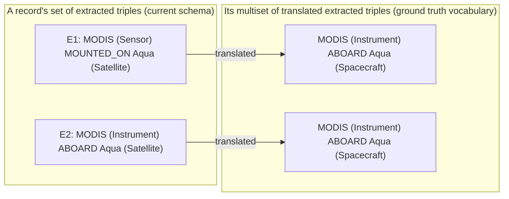

# What the metrics count: pairs

Part of [Evaluation metrics](../metrics.md), which explains the notation and lists every metric.

## <ins>Definition</ins>

Each record in evaluation has two associated sets: its [set of extracted triples](../../docs/terminology.md#6-extracting-with-a-schema-step-060) and its [set of ground truth triples](../../docs/terminology.md#4-ground-truth-and-samples). Before comparing these two sets of a record in evaluation, each [extracted triple](../../docs/terminology.md#6-extracting-with-a-schema-step-060) is translated into a [translated extracted triple](../../docs/terminology.md#7-evaluating-extraction-step-070). The result of this translation operation on the set of extracted triples is a collection of translated extracted triples. This collection is a multiset, not a set: two extracted triples can translate to the same translated extracted triple. Example: [Pairs: example](#example), *A multiset of translated extracted triples*.

For each record in evaluation, each occurrence in its multiset of translated extracted triples is given at most one partner from its set of ground truth triples, and each of its ground truth triples is given at most one partner from that multiset. We call two such partners a **pair**.

Evaluation forms a pair between a translated extracted triple and a [ground truth triple](../../docs/terminology.md#4-ground-truth-and-samples) of the same record when it takes them to state the same fact, and there are two ways to define "same fact", distinguished by pair level.

There are two **pair levels**, exact and partial. A translated extracted triple and a ground truth triple of the same record are **eligible** to pair at a pair level when they meet the pair level's requirements:

- exact: all three hold:
  - the same predicate;
  - the same [subject instance](../../docs/terminology.md#2-triples), once [evened out](../../docs/terminology.md#2-triples);
  - the same [object instance](../../docs/terminology.md#2-triples), once evened out.
- partial: all three hold:
  - the same predicate;
  - (the same subject instance, once evened out) ∨ (one subject instance appears inside the other as whole words, either way round);
  - (the same object instance, once evened out) ∨ (one object instance appears inside the other as whole words, either way round).

Being eligible doesn't make a translated extracted triple and a ground truth triple a pair, since each can have only one partner. A **set of pairs** is one choice of partners in a record; a record often has several possible sets of pairs. Evaluation picks a record's pairs in this order:

1. **Exact pairs.** Among the extracted triples and ground truth triples eligible at the exact level, evaluation takes the largest possible set of pairs, so that as many of them as possible get a partner (a *maximum matching*); when several sets of pairs are equally large (have as many pairs), it takes one with the most strict pairs (defined below). These are the record's **exact pairs**.
2. **Partial pairs.** Then, among [the extracted triples and ground truth triples still without a partner], it does the same at the partial level. These are the record's **partial pairs**.

Examples: [Example](#example), *The largest set of pairs* and *Equally large sets of pairs*. Evaluation never pairs an extracted triple and a ground truth triple you marked "not the same fact" when reviewing partial pairs (*When a pair isn't the same fact*, below, row 1).

A pair of either level is a **strict pair** when it also has (the same [subject classes](../../docs/terminology.md#2-triples)) ∧ (the same [object classes](../../docs/terminology.md#2-triples)). So every pair is exactly one of these four:

| | strict ((same subject classes) ∧ (same object classes)) | not strict |
|---|---|---|
| exact pair | exact pairs ∩ strict pairs | exact pairs, not strict |
| partial pair | partial pairs ∩ strict pairs | partial pairs, not strict |

All pairs = exact pairs ∪ partial pairs (no pair is both). Strict pairs are some of each.

An extracted triple left without a partner is **extracted only**; a ground truth triple left without a partner is **ground truth only**.

Precision and recall are computed from pairs. Each has versions that differ in which pairs they count (by pair level and strictness: see [precision](precision.md) and [recall](recall.md)). An extracted triple in a pair that a version of precision counts is called [*correct*](precision.md); a ground truth triple in a pair that a version of recall counts is called [*found*](recall.md).

## <ins>Assumes and can't see</ins>

- A pair can be wrong: containment can be fooled ("MODIS" is inside "MODIS Terra", a different instrument), and two [component classes](../../docs/terminology.md#3-schemas) of the [current schema](../../docs/terminology.md#6-extracting-with-a-schema-step-060) that translate to one component class of the [ground truth vocabulary](../../docs/terminology.md#7-evaluating-extraction-step-070) can't be told apart. All the causes: *When a pair isn't the same fact*, below.
- An extracted triple and a ground truth triple that state the same fact in different words never pair, so both count against the metrics. Example: [Pairs: example](#example), *The same fact in different words*.

## <ins>When a pair isn't the same fact</ins>

A pair counts its extracted triple as correct, for precision, and its ground truth triple as found, for recall. When the two don't state the same fact, or the fact they state is false, both counts are wrong: the pair raises a version of precision and the same version of recall.

| # | Cause | Example | Versions of precision and recall it raises | Whose doing | What to do |
|---|---|---|---|---|---|
| 1 | Containment fooled at the partial level | "MODIS" ABOARD "Aqua" pairs with "MODIS Terra" ABOARD "Aqua", a different instrument | partial versions | pairing | review partial pairs in the [annotation tool](../../docs/terminology.md#4-ground-truth-and-samples) (*Partial pairs*; tuning records only): one you mark "not the same fact" is never paired; the [held-out part](../../docs/terminology.md#7-evaluating-extraction-step-070)'s are never reviewed, so read its partial versions with that in mind |
| 2 | A partial pair you marked "same fact" by mistake | you marked "MODIS" vs "MODIS Terra" as the same fact (a "same fact" verdict changes nothing: only "not the same fact" keeps an extracted triple and a ground truth triple from pairing) | partial versions | your review | mark it "not the same fact" instead (annotation tool, *Partial pairs*) |
| 3 | The [ground truth](../../docs/terminology.md#4-ground-truth-and-samples) and extraction make the same mistake | both say "MODIS" ABOARD "Terra", which the text doesn't state | all | ground truth (and extraction) | check the ground truth against the text; use different models for drafting (050) and extraction (060), since models alike make mistakes alike |
| 4 | A wrong row of the [translation table](../../docs/terminology.md#7-evaluating-extraction-step-070) makes a wrong extracted triple pair | extraction says "MODIS" ACQUIRED_BY "Aqua" (wrong), and the row ACQUIRED_BY → ABOARD makes it pair with "MODIS" ABOARD "Aqua" | all | translation table | fix the row |
| 5 | Two component classes of the current schema translate to one | `Sensor` and `Instrument` both → `Instrument`: an extracted triple with the wrong one of the two still counts as strict | strict versions | the two vocabularies differ | none: evaluation can't tell them apart |

Worked example: [Pairs: example](#example). Sources: [Pairs: sources](#sources).

## Example

*A multiset of translated extracted triples.* A record has two [extracted triples](../../docs/terminology.md#6-extracting-with-a-schema-step-060), E1 and E2, and the [translation table](../../docs/terminology.md#7-evaluating-extraction-step-070) says:

| Kind | Component class of the current schema | Translates to (ground truth vocabulary) |
|---|---|---|
| predicate | MOUNTED_ON | ABOARD |
| predicate | ABOARD | ABOARD |
| [entity class](../../docs/terminology.md#3-schemas) | `Sensor` | `Instrument` |
| entity class | `Instrument` | `Instrument` |
| entity class | `Satellite` | `Spacecraft` |

E1 and E2 are two elements of the [set of extracted triples](../../docs/terminology.md#6-extracting-with-a-schema-step-060). Their [translated extracted triples](../../docs/terminology.md#7-evaluating-extraction-step-070) read the same, so they are one element of the multiset, call it *t* = "MODIS" (Instrument) ABOARD "Aqua" (Spacecraft), and the multiset is {*t*, *t*}. Each single time an element is in a multiset is an **occurrence** of it, and how many occurrences a multiset element has is its **multiplicity**: here *t* has two occurrences, so its multiplicity is 2. Pairing gives each occurrence its own partner, at most one: one occurrence of *t* can pair with a [ground truth triple](../../docs/terminology.md#4-ground-truth-and-samples), and the other can pair with a different ground truth triple or be left without a partner.

*Every outcome in one record.* Another [record](../../docs/terminology.md#1-records-and-their-text). Its ground truth triples:

| | Subject instance (subject class) | Predicate | Object instance (object class) |
|---|---|---|---|
| G1 | MODIS (Instrument) | ABOARD | Aqua (Spacecraft) |
| G2 | AIRS (Instrument) | ABOARD | Aqua (Spacecraft) |
| G3 | MODIS Snow Cover (Dataset) | ACQUIRED_BY | MODIS (Instrument) |
| G4 | MODIS Snow Cover (Dataset) | HAS_TIME_SPAN | 2002–2023 (TimeSpan) |
| G5 | CERES (Instrument) | ABOARD | Aqua (Spacecraft) |

Its extracted triples, after translation, and what each becomes:

| | Subject instance (subject class) | Predicate | Object instance (object class) | Outcome |
|---|---|---|---|---|
| E1 | the MODIS (Instrument) | ABOARD | Aqua (Spacecraft) | exact pair with G1 ("the" is ignored); strict |
| E2 | AIRS (Dataset) | ABOARD | Aqua (Spacecraft) | exact pair with G2; not strict ([subject class](../../docs/terminology.md#2-triples) Dataset, not Instrument) |
| E3 | MODIS Snow Cover 5-Min L2 Swath (Dataset) | ACQUIRED_BY | Moderate Resolution Imaging Spectroradiometer (MODIS) (Instrument) | partial pair with G3 ("MODIS Snow Cover" is inside the [subject instance](../../docs/terminology.md#2-triples), "MODIS" inside the [object instance](../../docs/terminology.md#2-triples)); strict |
| E4 | MODIS Snow Cover (Dataset) | HAS_TIME_SPAN | the period 2002–2023 (Dataset) | partial pair with G4 ("2002–2023" is inside the object instance); not strict ([object class](../../docs/terminology.md#2-triples) Dataset, not TimeSpan) |
| E5 | MODIS (Instrument) | ABOARD | Terra (Spacecraft) | extracted only: no ground truth triple has the [object](../../docs/terminology.md#2-triples) Terra |
| E6 | Moderate Resolution Imaging Spectroradiometer (MODIS) (Instrument) | ABOARD | Aqua (Spacecraft) | extracted only: it would form a partial pair with G1, but G1 already has an exact partner, E1, and a ground truth triple has at most one partner |

And G5 (CERES ABOARD Aqua) has no partner: ground truth only, a missed [fact](../../docs/terminology.md#2-triples).

In all: 6 extracted triples, 5 ground truth triples; 2 exact pairs (E1–G1 strict, E2–G2 not); 2 partial pairs (E3–G3 strict, E4–G4 not); so 2 strict pairs, one at each pair level; 2 extracted only (E5, E6); 1 ground truth only (G5).

*The largest set of pairs.* At the partial level, the [ground truth](../../docs/terminology.md#4-ground-truth-and-samples) has "MODIS instrument suite ABOARD Aqua" and "Terra MODIS ABOARD Aqua"; extraction gives "MODIS ABOARD Aqua" and "MODIS instrument ABOARD Aqua". "MODIS instrument suite ABOARD Aqua" could pair with either extracted triple; "Terra MODIS ABOARD Aqua" only with "MODIS ABOARD Aqua". Taking each ground truth triple's first possible partner, the first ground truth triple takes "MODIS ABOARD Aqua", and the second is left without one: 1 pair. Evaluation instead pairs "MODIS instrument suite ABOARD Aqua" with "MODIS instrument ABOARD Aqua", and "Terra MODIS ABOARD Aqua" with "MODIS ABOARD Aqua": 2 pairs.

*Equally large sets of pairs.* A record's ground truth has G1, "MODIS" (Instrument) ABOARD "Aqua" (Spacecraft). Extraction gives E1, "MODIS" (Dataset) ABOARD "Aqua" (Spacecraft), then E2, "MODIS" (Instrument) ABOARD "Aqua" (Spacecraft). Each can form an exact pair with G1, which can have only one partner, so the record has two possible sets of pairs: {E1–G1}, leaving E2 extracted only, and {E2–G1}, leaving E1 extracted only. Both have 1 pair: they are equally large. Evaluation takes {E2–G1}, whose pair is strict. Which of E1 and E2 comes first in the file doesn't matter.

*The same fact in different words.* A record's ground truth has "MODIS" ABOARD "Aqua". Extraction gives "the imaging spectroradiometer" ABOARD "the Aqua satellite".

- Both state the same fact, but neither pair level pairs them: neither subject instance contains the other.
- So the extracted triple is extracted only, lowering precision, and the ground truth triple is ground truth only, lowering recall, though extraction got the fact right.
- With LLMs this is common. In one study, people judged about half of the extracted triples that exact matching counted wrong to be derivable from the text after all (51.67% and 50.27%, on two datasets; Wadhwa et al., 2023). That half has two causes: the same fact in different words, as here, and facts the ground truth lacked.

There are two ways to catch it:

- **An AI model judges** whether such an extracted triple and ground truth triple state the same fact, as a third pair level. Evaluation doesn't do this: every run would cost [model calls](../../docs/terminology.md#8-the-pipeline), and a model tends to favor output like its own.
- **A person checks a sample** of the extracted triples left extracted only and counts how many are actually true. This doesn't change the metrics; it shows how far they are understated. Not done yet (see `070_evaluate/070_evaluate.md`, *To do*).

## Sources

- *Exact* and *partial*: the WebNLG 2020 challenge's evaluation of text-to-triples extraction (Castro Ferreira et al., 2020, [paper](https://aclanthology.org/2020.webnlg-1.7.pdf)). Its numbers aren't directly comparable with ours for three reasons. WebNLG compares an [extracted triple](../../docs/terminology.md#6-extracting-with-a-schema-step-060) with a [ground truth triple](../../docs/terminology.md#4-ground-truth-and-samples) component by component: it scores the subject instance, the predicate, and the object instance each on its own (WebNLG has no [entity classes](../../docs/terminology.md#3-schemas)), so an extracted triple with two of its three components matching earns credit for those two; we count an extracted triple as correct only when it forms a pair, meeting the requirements of its pair level. We do it this way because an edge of the [knowledge graph](../../docs/terminology.md#8-the-pipeline) with one wrong component states a wrong fact. WebNLG also averages per text, where we sum over all records. And at the partial level, WebNLG counts two [subject instances](../../docs/terminology.md#2-triples) (or two [object instances](../../docs/terminology.md#2-triples)) as a partial match when they share any text, where we require one to appear inside the other as whole words, either way round.
- Credit: here a partial pair counts as fully right. The SemEval-2013 scoring convention ([nervaluate](https://github.com/MantisAI/nervaluate)) gives a partial match half credit: partial [precision](precision.md) = (exact + 0.5 × partial) ÷ extracted. Full credit fits our meaning of a partial pair, the same [fact](../../docs/terminology.md#2-triples) named differently (on tuning [records](../../docs/terminology.md#1-records-and-their-text), confirmed by your review), but our partial numbers are higher than that convention's and not directly comparable with published partial scores. That convention's number is the average of our two levels: (exact ÷ extracted + (exact + partial) ÷ extracted) ÷ 2 = (exact + 0.5 × partial) ÷ extracted; for recall, the same with ground truth triples in place of extracted triples.
- *Strict*, meaning right relation and right entity types: the "Strict" [setting](../../docs/terminology.md#8-the-pipeline) of end-to-end relation extraction (Bekoulis et al., 2018, as described by Taillé et al., 2020, [paper](https://aclanthology.org/2020.emnlp-main.301/)). WebNLG's "strict" means something else (the element's role must match), so it isn't the source here.
- The same fact in different words ([Pairs: example](#example), *The same fact in different words*): Wadhwa, Amir & Wallace, "Revisiting Relation Extraction in the era of Large Language Models", ACL 2023 ([paper](https://aclanthology.org/2023.acl-long.868/)), §5.
- At most one partner per extracted triple and per ground truth triple, largest set of pairs, and among those the most strict pairs: a minimum-cost maximum matching, each non-strict pair costing 1 and each strict pair 0 (successive shortest augmenting paths, `070_evaluate/070_evaluate_helpers/pairing.py`). Choosing among alignments by weight, not just by size, is how coreference's CEAF does it (Luo, 2005, paper: a maximum-weight bipartite matching, by the Kuhn–Munkres algorithm).
