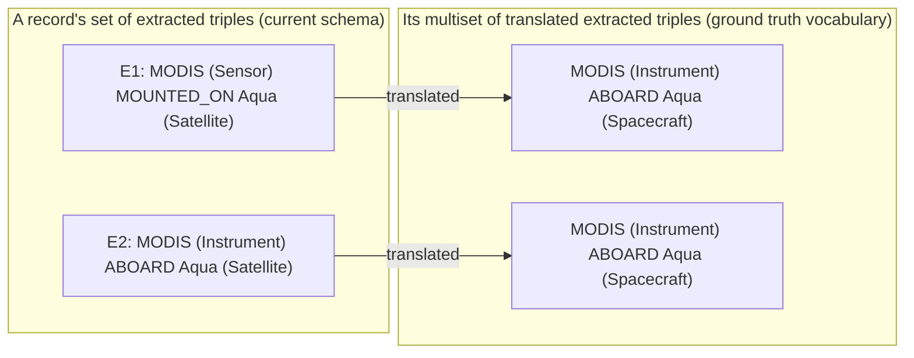
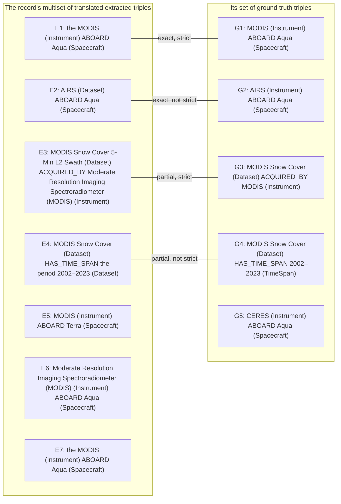

# What the metrics count: pairs

Part of [Evaluation metrics](../metrics.md), which explains the notation and lists every metric.

## <ins>Definition</ins>

Each record in evaluation has two associated sets: its [set of extracted triples](../../docs/terminology.md#6-extracting-with-a-schema-step-060) and its [set of ground truth triples](../../docs/terminology.md#4-ground-truth-and-samples). Before comparing these two sets of a record in evaluation, each [extracted triple](../../docs/terminology.md#6-extracting-with-a-schema-step-060) is translated into a [translated extracted triple](../../docs/terminology.md#7-evaluating-extraction-step-070). The result of this translation operation on the set of extracted triples is a collection of translated extracted triples. This collection is a multiset, not a set: two extracted triples can translate to the same translated extracted triple (see [Pairs: example](#example), *A multiset of translated extracted triples*).

For each record in evaluation, each occurrence in its multiset of translated extracted triples is given at most one partner from its set of ground truth triples, and each of its ground truth triples is given at most one partner from that multiset. We call two such partners a **pair**.

Evaluation forms a pair between an [occurrence in a record's multiset of translated extracted triples](../../docs/terminology.md#7-evaluating-extraction-step-070) and a [ground truth triple](../../docs/terminology.md#4-ground-truth-and-samples) of the same record when it takes them to state the same fact. What counts as the same fact depends on the **pair level**, exact or partial: the two are **eligible** to pair at a pair level when they meet the pair level's requirements:

- Exact pair eligibility is met when the following three hold for an occurrence in a record's multiset of translated extracted triples and a ground truth triple of the same record:
  - they have the same [predicate](../../docs/terminology.md#3-schemas), by [loose match](../../docs/terminology.md#3-schemas);
  - they have the same [subject instance](../../docs/terminology.md#2-triples), once [evened out](../../docs/terminology.md#2-triples);
  - they have the same [object instance](../../docs/terminology.md#2-triples), once evened out.
- Partial pair eligibility is met when the following three hold for an occurrence in a record's multiset of translated extracted triples and a ground truth triple of the same record:
  - they have the same predicate, by loose match;
  - at least one of these holds for their subject instances, once evened out:
    - the two are the same;
    - the occurrence's subject instance appears, as whole words, inside the ground truth triple's subject instance;
    - the ground truth triple's subject instance appears, as whole words, inside the occurrence's subject instance;
  - at least one of these holds for their object instances, once evened out:
    - the two are the same;
    - the occurrence's object instance appears, as whole words, inside the ground truth triple's object instance;
    - the ground truth triple's object instance appears, as whole words, inside the occurrence's object instance.

Being eligible doesn't make an occurrence in a record's multiset of translated extracted triples and a ground truth triple a pair. Evaluation picks a record's pairs in the following order (a **set of pairs** is one choice of pairs in a record; a record often has several possible sets of pairs; examples: [Example](#example), *The largest set of pairs* and *Equally large sets of pairs*):

1. **Exact pairs.** Among [the occurrences in the record's multiset of translated extracted triples] and [the record's ground truth triples], evaluation looks at those eligible at the exact pair level and takes the largest possible set of pairs, so that as many of [the occurrences in the record's multiset of translated extracted triples] as possible get a partner (in graph theory, a *maximum matching*). When several sets of pairs are equally large (have an equal number of pairs), evaluation takes one with the largest number of strict pairs (defined below). The pairs in this set are the record's **exact pairs**.
2. **Partial pairs.** Then, among [the occurrences in the record's multiset of translated extracted triples still without a partner] and [the record's ground truth triples still without a partner], evaluation does the same but at the partial pair level: it looks at those eligible at the partial pair level and takes the largest possible set of pairs, and when several are equally large, one with the largest number of strict pairs. The pairs in this set are the record's **partial pairs**.

After this pairing process, an occurrence in the record's multiset of translated extracted triples still without a partner is **extracted only**, and a ground truth triple still without a partner is **ground truth only**. They aren't dropped: precision divides by every occurrence, so each extracted only occurrence lowers precision, and recall divides by every ground truth triple, so each ground truth only triple lowers recall.

A pair of either level is a **strict pair** when it also has, by loose match, (the same [subject classes](../../docs/terminology.md#2-triples)) ∧ (the same [object classes](../../docs/terminology.md#2-triples)). So every pair is exactly one of these four:

| | strict ((same subject classes) ∧ (same object classes)) | not strict |
|---|---|---|
| exact pair | exact pairs ∩ strict pairs | exact pairs, not strict |
| partial pair | partial pairs ∩ strict pairs | partial pairs, not strict |

All pairs = exact pairs ∪ partial pairs (no pair is both). Strict pairs are some of each.

Precision and recall are computed from pairs. Each has versions that differ in which pairs they count (by pair level and strictness: see [precision](precision.md) and [recall](recall.md)). An occurrence in a pair that a version of precision counts is called [*correct*](precision.md); a ground truth triple in a pair that a version of recall counts is called [*found*](recall.md).

## <ins>Assumes and can't see</ins>

- A pair can be wrong: see *When a pair isn't the same fact*, below.
- An occurrence and a ground truth triple that state the same fact in different words never pair, so both count against the metrics. Example: [Pairs: example](#example), *The same fact in different words*.
- Exact pairs are picked first, and partial pairs only among what's left, so the partial level can end with fewer pairs than pairing both levels together would make. In exchange, an exact pair is never given up to make room for partial ones. Example: [Pairs: example](#example), *Exact pairs first*.

## <ins>When a pair isn't the same fact</ins>

A pair counts its occurrence as correct, for precision, and its ground truth triple as found, for recall. When the two don't state the same fact, or the fact they state is false, the occurrence is counted as correct and the ground truth triple as found, though neither should be. What that does to precision and recall depends on what would have paired without the wrong pair (higher precision and recall mean better extraction):

- usually it adds a pair that wouldn't exist otherwise, so they come out higher than they should, and extraction looks better than it is;
- sometimes it takes a right pair's place, so they come out unchanged, though two triples are judged wrongly;
- rarely, a wrong exact pair takes two triples that each had a right partial partner, so the partial versions come out one pair lower than they should;
- the strict versions can move either way, even by more than one pair, because a wrong pair can change which of several equally large sets of pairs evaluation takes.

A wrong pair never lowers the exact versions, and never moves the other versions by more than one pair. Each case, with numbers: [Pairs: example](#example), *A wrong pair*.

| # | Cause | Example | Versions of precision and recall it affects | Caused by | What to do |
|---|---|---|---|---|---|
| 1 | Containment fooled at the partial level | The [ground truth](../../docs/terminology.md#4-ground-truth-and-samples) has "MODIS" (Instrument) ABOARD "Aqua" (Spacecraft). Extraction gives "MODIS Terra" (Instrument) ABOARD "Aqua" (Spacecraft): it names the MODIS instrument on Terra, a different instrument. "MODIS" is inside "MODIS Terra" as whole words, and the predicate and the object instance are the same, so the two are eligible at the partial level, and they pair (Example: *A wrong pair*, below) | partial versions | code (pairing, step 070) | review partial pairs in the [annotation tool](../../docs/terminology.md#4-ground-truth-and-samples) (*Partial pairs*; tuning records only): one you mark "not the same fact" is never paired. The [held-out part](../../docs/terminology.md#7-evaluating-extraction-step-070)'s partial pairs aren't reviewed until the pipeline is frozen for the final evaluation (see `070_evaluate/070_evaluate.md`, *Known limits*) |
| 2 | A partial pair you marked "same fact" by mistake | The pair of row 1, and when reviewing partial pairs you pressed **Same fact** for it. The pair stays, as it would with no verdict: a "same fact" verdict changes nothing, and only "not the same fact" keeps an occurrence and a ground truth triple from pairing | partial versions | you (your review of partial pairs) | mark it "not the same fact" instead (annotation tool, *Partial pairs*). Review with care: decide each pair from the record's text (click *The record's text* under the pair to read it), not from how alike the two [classed triples](../../docs/terminology.md#2-triples) look. Subject instances or object instances that share words often refer to different things: "MODIS Terra" and "MODIS" are different instruments, and "MODIS Snow Cover" and "MODIS Snow Cover Daily" are different datasets. A wrong "same fact" leaves a wrong pair counted as correct, and nothing else will catch it |
| 3 | The ground truth and extraction make the same mistake | The record's text says MODIS is aboard Aqua. The ground truth has "MODIS" ABOARD "Terra" (the person annotating kept a wrong row of the model's draft), and extraction also gives "MODIS" ABOARD "Terra". The two are the same, so they form an exact pair, though the text doesn't state that fact | all | you (the ground truth) and the model (extraction, step 060) | fix the ground truth in the annotation tool (tuning records only: you see only the [tuning part](../../docs/terminology.md#7-evaluating-extraction-step-070)'s results), then rerun step 070; and extract with a model from another maker than the one that drafted the ground truth (models alike make mistakes alike; step 060 warns before paying when they are the same model or maker) |
| 4 | A wrong row of the [translation table](../../docs/terminology.md#7-evaluating-extraction-step-070) makes the occurrence of a wrong extracted triple pair | The ground truth has "MODIS" ABOARD "Aqua". Extraction gives "MODIS" ACQUIRED_BY "Aqua", which is wrong: the text doesn't say MODIS acquired Aqua. The translation table's row for ACQUIRED_BY says → ABOARD, also wrong. So the translated extracted triple reads "MODIS" ABOARD "Aqua", and it pairs exactly with the ground truth triple: two mistakes cancel out | all | the model (extraction, step 060), which stated a wrong fact, and you (a row you checked: the model proposed it, and the check missed it), which turned it into the ground truth's fact | fix the row in the annotation tool (*Translation table*), then rerun step 070: the wrong extracted triple then correctly counts as not correct; and improve extraction (see [Precision](precision.md), *When an occurrence counts as not correct*) |
| 5 | Two [component classes](../../docs/terminology.md#3-schemas) of the [current schema](../../docs/terminology.md#6-extracting-with-a-schema-step-060) translate to one | The current schema has both `Sensor` and `Instrument`, and the translation table translates both to `Instrument`. The ground truth has "MODIS" (Instrument) ABOARD "Aqua". Extraction gives "MODIS" (Sensor) ABOARD "Aqua", though by the current schema's own definitions MODIS is an `Instrument`. Translated, it reads "MODIS" (Instrument) ABOARD "Aqua", so the pair is strict, though extraction picked the wrong [entity class](../../docs/terminology.md#3-schemas) of the current schema | strict versions | the model (extraction, step 060), which picked the wrong one of the two; evaluation can't see it, because the current schema, from step 040, has two component classes where the [ground truth vocabulary](../../docs/terminology.md#7-evaluating-extraction-step-070) has one | none within evaluation: it can't tell the two apart (the annotation tool marks such rows with the [row state](../../docs/terminology.md#7-evaluating-extraction-step-070) *shared*). If the difference matters, give the ground truth vocabulary the finer entity class (coin it in the ground truth, tuning records only), then give each row its own counterpart (annotation tool, *Translation table*) |

Worked example: [Pairs: example](#example). Sources: [Pairs: sources](#sources).

## Example

*A multiset of translated extracted triples.* A record has two [extracted triples](../../docs/terminology.md#6-extracting-with-a-schema-step-060), E1 and E2, and the [translation table](../../docs/terminology.md#7-evaluating-extraction-step-070) says:

| Kind | Component class of the current schema | Translates to ([ground truth vocabulary](../../docs/terminology.md#7-evaluating-extraction-step-070)) |
|---|---|---|
| predicate | MOUNTED_ON | ABOARD |
| predicate | ABOARD | ABOARD |
| [entity class](../../docs/terminology.md#3-schemas) | `Sensor` | `Instrument` |
| entity class | `Instrument` | `Instrument` |
| entity class | `Satellite` | `Spacecraft` |

E1 and E2 are two elements of the [set of extracted triples](../../docs/terminology.md#6-extracting-with-a-schema-step-060). Their [translated extracted triples](../../docs/terminology.md#7-evaluating-extraction-step-070) read the same, so they are one element of the multiset, call it *t* = "MODIS" (Instrument) ABOARD "Aqua" (Spacecraft), and the multiset is {*t*, *t*}. Each single time an element is in a multiset is an **occurrence** of it, and how many occurrences a multiset element has is its **multiplicity**: here *t* has two occurrences, so its multiplicity is 2. Pairing gives each occurrence at most one [ground truth triple](../../docs/terminology.md#4-ground-truth-and-samples) partner (see *Every outcome in one record*, below).

*Every outcome in one record.* Another [record](../../docs/terminology.md#1-records-and-their-text). Its ground truth triples:

| | Subject instance (subject class) | Predicate | Object instance (object class) |
|---|---|---|---|
| G1 | MODIS (Instrument) | ABOARD | Aqua (Spacecraft) |
| G2 | AIRS (Instrument) | ABOARD | Aqua (Spacecraft) |
| G3 | MODIS Snow Cover (Dataset) | ACQUIRED_BY | MODIS (Instrument) |
| G4 | MODIS Snow Cover (Dataset) | HAS_TIME_SPAN | 2002–2023 (TimeSpan) |
| G5 | CERES (Instrument) | ABOARD | Aqua (Spacecraft) |

The translation table translates every [component class](../../docs/terminology.md#3-schemas) here to itself, except:

| Kind | Component class of the current schema | Translates to (ground truth vocabulary) |
|---|---|---|
| predicate | MOUNTED_ON | ABOARD |
| entity class | `Sensor` | `Instrument` |
| entity class | `Satellite` | `Spacecraft` |

Its translated extracted triples, and what each becomes:

| | Subject instance (subject class) | Predicate | Object instance (object class) | Outcome |
|---|---|---|---|---|
| E1 | the MODIS (Instrument) | ABOARD | Aqua (Spacecraft) | exact pair with G1 ("the" is ignored); strict |
| E2 | AIRS (Dataset) | ABOARD | Aqua (Spacecraft) | exact pair with G2; not strict ([subject class](../../docs/terminology.md#2-triples) Dataset, not Instrument) |
| E3 | MODIS Snow Cover 5-Min L2 Swath (Dataset) | ACQUIRED_BY | Moderate Resolution Imaging Spectroradiometer (MODIS) (Instrument) | partial pair with G3 ("MODIS Snow Cover" is inside the [subject instance](../../docs/terminology.md#2-triples), "MODIS" inside the [object instance](../../docs/terminology.md#2-triples)); strict |
| E4 | MODIS Snow Cover (Dataset) | HAS_TIME_SPAN | the period 2002–2023 (Dataset) | partial pair with G4 ("2002–2023" is inside the object instance); not strict ([object class](../../docs/terminology.md#2-triples) Dataset, not TimeSpan) |
| E5 | MODIS (Instrument) | ABOARD | Terra (Spacecraft) | extracted only: the record's text doesn't say MODIS is aboard Terra (in the real world a MODIS instrument is, but this record doesn't state it), so no ground truth triple has the [object](../../docs/terminology.md#2-triples) Terra |
| E6 | Moderate Resolution Imaging Spectroradiometer (MODIS) (Instrument) | ABOARD | Aqua (Spacecraft) | extracted only: it repeats G1's fact, with the subject instance named in full; it would form a partial pair with G1, but G1 already has an exact partner, E1, and a ground truth triple has at most one partner |
| E7 | the MODIS (Instrument) | ABOARD | Aqua (Spacecraft) | extracted only: extracted as "the MODIS" (Sensor) MOUNTED_ON "Aqua" (Satellite), it translates to exactly what E1 translates to, so the record's multiset of translated extracted triples holds that element twice; G1 can have only one partner, and takes the occurrence from E1 (either occurrence would make the same exact, strict pair) |

And G5 (CERES ABOARD Aqua) has no partner: ground truth only, a missed [fact](../../docs/terminology.md#2-triples).

Each line is a pair. Without a line: E5, E6, and E7 are extracted only, and G5 is ground truth only.

In all: 7 occurrences, 5 ground truth triples; 2 exact pairs (E1–G1 strict, E2–G2 not); 2 partial pairs (E3–G3 strict, E4–G4 not); so 2 strict pairs, one at each pair level; 3 extracted only (E5, E6, E7); 1 ground truth only (G5).

*The largest set of pairs.* A record describes a dataset made from both MODIS instruments, the one on Terra and the one on Aqua. Its [ground truth](../../docs/terminology.md#4-ground-truth-and-samples) has G0, "MODIS Snow Cover" ACQUIRED_BY "Aqua MODIS", and G1, "MODIS Snow Cover" ACQUIRED_BY "Terra MODIS". Extraction gives E0, "MODIS Snow Cover" ACQUIRED_BY "MODIS", and E1, "MODIS Snow Cover" ACQUIRED_BY "the Aqua MODIS instrument" (every entity class the same).

| | G0: "Aqua MODIS" | G1: "Terra MODIS" |
|---|---|---|
| E0: "MODIS" | eligible: partial ("MODIS" is inside "Aqua MODIS") | eligible: partial ("MODIS" is inside "Terra MODIS") |
| E1: "the Aqua MODIS instrument" | eligible: partial ("Aqua MODIS" is inside "the Aqua MODIS instrument") | not eligible (neither is inside the other) |

Taking each ground truth triple's first possible partner, G0 takes E0, and G1 is left without one, since its only possible partner, E0, is taken: 1 pair. Evaluation instead takes the largest possible set of pairs, G0 with E1 and G1 with E0: 2 pairs, both right. E0's "MODIS" is less specific than "Terra MODIS", since it could name either instrument, but it names an instrument that did acquire the data, so the pair states the same fact, named differently.

*Equally large sets of pairs.* A record's ground truth has G1, "MODIS" (Instrument) ABOARD "Aqua" (Spacecraft). Extraction gives E1, "MODIS" (Dataset) ABOARD "Aqua" (Spacecraft), then E2, "MODIS" (Instrument) ABOARD "Aqua" (Spacecraft). Each can form an exact pair with G1, which can have only one partner, so the record has two possible sets of pairs: {E1–G1}, leaving E2 extracted only, and {E2–G1}, leaving E1 extracted only. Both have 1 pair: they are equally large. Evaluation takes {E2–G1}, whose pair is strict. Which of E1 and E2 comes first in the file doesn't matter.

*Exact pairs first.* A record describes two datasets, "MODIS Snow Cover" and "MODIS Snow Cover Daily", both made by MODIS. Its ground truth has G0, "MODIS Snow Cover" ACQUIRED_BY "MODIS", and G1, "MODIS Snow Cover Daily" ACQUIRED_BY "MODIS". Extraction gives E0, "MODIS Snow Cover" ACQUIRED_BY "MODIS", and E1, "the MODIS Snow Cover product" ACQUIRED_BY "MODIS", which repeats G0's fact (every entity class the same).

| | G0: "MODIS Snow Cover" | G1: "MODIS Snow Cover Daily" |
|---|---|---|
| E0: "MODIS Snow Cover" | eligible: exact | eligible: partial ("MODIS Snow Cover" is inside "MODIS Snow Cover Daily") |
| E1: "the MODIS Snow Cover product" | eligible: partial ("MODIS Snow Cover" is inside "the MODIS Snow Cover product") | not eligible (neither is inside the other) |

Evaluation first makes the exact pair E0–G0. That leaves E1 and G1, which aren't eligible, so the record has 1 pair, and it is right: exact precision 1 of 2, and partial precision 1 of 2. Pairing both levels together could make 2 partial pairs, E1–G0 and E0–G1: exact precision 0 of 2, and partial precision 2 of 2. But E0–G1 pairs "MODIS Snow Cover" with "MODIS Snow Cover Daily", two different datasets, so one of those 2 pairs would be wrong, and the exact pair E0–G0, two [classed triples](../../docs/terminology.md#2-triples) that state exactly the same thing, would be lost.

*Whole words inside, not any overlap.* A record's ground truth has "MODIS Snow Cover" (Dataset) ACQUIRED_BY "MODIS" (Instrument). Extraction gives "MODIS Land Surface Temperature" (Dataset) ACQUIRED_BY "MODIS" (Instrument): a different dataset, made by the same instrument.

- The two subject instances share one word, "MODIS". Neither is inside the other as whole words: "MODIS Snow Cover" isn't inside "MODIS Land Surface Temperature", and "MODIS Land Surface Temperature" isn't inside "MODIS Snow Cover". So the two aren't eligible at the partial level, and stay unpaired. That's right: they state different facts.
- Under a rule that accepts any shared text, as WebNLG's and SemEval-2013's partial matching do, the shared word "MODIS" would make them a partial match. In NASA's catalog that would happen constantly: words like "MODIS", "Level 2", "Daily" and "Global" each appear in many different names.
- What such a false match does to precision depends on the credit a partial match gets. Here the record has 1 occurrence and the false match is its only one. With half credit (SemEval-2013's convention), precision would be 0.5 ÷ 1 = 50%. With full credit, as at our partial level, it would be 1 ÷ 1 = 100%: a different dataset counted as entirely right. Since our partial level gives full credit, a false match costs twice as much as under half credit, so the rule for what counts as a partial match must be stricter.
- By contrast, "MODIS Snow Cover" is inside "MODIS Snow Cover 5-Min L2 Swath" as whole words: the same dataset, named more fully. Those two are eligible at the partial level (E3 and G3 in *Every outcome in one record*).

*A wrong pair.* How a pair that isn't the same fact affects precision and recall. A record's ground truth has one ground truth triple, G1: "MODIS" (Instrument) ABOARD "Aqua" (Spacecraft).

**Case 1: nothing else would have paired.** Extraction gives one extracted triple, E1: "MODIS Terra" (Instrument) ABOARD "Aqua" (Spacecraft). It names the MODIS instrument on Terra, a different instrument from the one on Aqua, so E1 and G1 state different facts. But "MODIS" is inside "MODIS Terra" as whole words, and the predicate and the object instance are the same, so they are eligible at the partial level, and they pair.

| | As evaluated (E1–G1 paired) | Right (no pair) |
|---|---|---|
| Partial precision | 1 ÷ 1 = 100% | 0 ÷ 1 = 0% |
| Partial recall | 1 ÷ 1 = 100% | 0 ÷ 1 = 0% |

Both come out too high.

**Case 2: the wrong pair takes a right pair's place.** Extraction gives E1, as in case 1, and then E2: "the MODIS instrument" (Instrument) ABOARD "Aqua" (Spacecraft), which does state G1's fact. "MODIS" is inside "the MODIS instrument" as whole words too, so E2 is also eligible with G1 at the partial level. G1 can have only one partner, so the record has two possible sets of pairs, {E1–G1} and {E2–G1}. Each has 1 pair, and each pair is strict, so they are equally large and equally strict, and evaluation takes the first: E1–G1. E2 is left extracted only.

| | As evaluated (E1–G1 paired) | Right (E2–G1 paired) |
|---|---|---|
| Partial precision | 1 ÷ 2 = 50% | 1 ÷ 2 = 50% |
| Partial recall | 1 ÷ 1 = 100% | 1 ÷ 1 = 100% |

The numbers are the same, but two occurrences are judged wrongly: E1's is counted correct, and E2's is counted not correct.

**Case 3: one pair fewer, at the partial level (rare).** It takes a wrong *exact* pair, which only a shared mistake or a wrong row of the translation table can make (rows 3 and 4 of *When a pair isn't the same fact*). A record has occurrences O1 and O2 and ground truth triples G1 and G2:

| | G1 | G2 |
|---|---|---|
| O1 | eligible: exact (wrongly) | eligible: partial (rightly) |
| O2 | eligible: partial (rightly) | not eligible |

Exact pairs come first, so evaluation pairs O1 with G1. That leaves O2 and G2, which aren't eligible: 1 pair. Without the wrong exact pair, O1 would pair with G2 and O2 with G1: 2 pairs, both right.

| | As evaluated (O1–G1) | Right (O1–G2 and O2–G1) |
|---|---|---|
| Exact precision and exact recall | 1 ÷ 2 = 50% | 0 ÷ 2 = 0% |
| Partial precision and partial recall | 1 ÷ 2 = 50% | 2 ÷ 2 = 100% |

The exact versions come out too high, and the partial versions too low.

**Case 4: only the strict versions move.** As in case 2, but E2, the right occurrence, has the wrong subject class: "the MODIS instrument" (Dataset) ABOARD "Aqua" (Spacecraft). E1, the wrong occurrence, has G1's entity classes. Both possible sets of pairs have 1 pair, so evaluation takes the one with more strict pairs: {E1–G1}, the wrong one.

| | As evaluated (E1–G1) | Right (E2–G1) |
|---|---|---|
| Partial precision | 1 ÷ 2 = 50% | 1 ÷ 2 = 50% |
| Strict partial precision | 1 ÷ 2 = 50% | 0 ÷ 2 = 0% |

The other versions are unchanged, and the strict ones come out too high. In bigger records a wrong pair can move the strict versions by more than one pair, either way.

In cases 1, 2, and 4 the wrong pair is a partial pair, so your review of partial pairs fixes it: marking E1–G1 "not the same fact" stops that pair. In case 1, E1 and G1 are then left without a partner; in cases 2 and 4, E2 pairs with G1. In case 3 the wrong pair is exact, and the review shows only partial pairs: fix its cause instead (rows 3 and 4 of *When a pair isn't the same fact*).

*The same fact in different words.* A record's ground truth has "MODIS" ABOARD "Aqua". Extraction gives "the imaging spectroradiometer" ABOARD "the Aqua satellite".

- Both state the same fact, but neither pair level pairs them: neither subject instance contains the other.
- So its occurrence is extracted only, lowering precision, and the ground truth triple is ground truth only, lowering recall, though extraction got the fact right.
- With LLMs this is common. In one study, people judged about half of the extracted triples that exact matching counted wrong to be derivable from the text after all (51.67% and 50.27%, on two datasets; Wadhwa et al., 2023). That half has two causes: the same fact in different words, as here, and facts the ground truth lacked.

There are two ways to catch it:

- **An AI model judges** whether such an occurrence and ground truth triple state the same fact, as a third pair level. Evaluation doesn't do this: every run would cost [model calls](../../docs/terminology.md#8-the-pipeline), and a model tends to favor output like its own.
- **A person checks a sample** of the occurrences left extracted only and counts how many are actually true. This doesn't change the metrics; it shows how far they are understated. Not done yet (see `070_evaluate/070_evaluate.md`, *To do*).

## Sources

- *Exact* and *partial*: the WebNLG 2020 challenge's evaluation of text-to-triples extraction (Castro Ferreira et al., 2020, [paper](https://aclanthology.org/2020.webnlg-1.7.pdf)). Its numbers aren't directly comparable with ours for three reasons. WebNLG compares an [extracted triple](../../docs/terminology.md#6-extracting-with-a-schema-step-060) with a [ground truth triple](../../docs/terminology.md#4-ground-truth-and-samples) component by component: it scores the [subject instance](../../docs/terminology.md#2-triples), the predicate, and the [object instance](../../docs/terminology.md#2-triples) each on its own (WebNLG has no [entity classes](../../docs/terminology.md#3-schemas)), so an extracted triple with two of its three components matching earns credit for those two; we count an occurrence as correct only when it forms a pair, meeting the requirements of its pair level. We do it this way because an edge of the [knowledge graph](../../docs/terminology.md#8-the-pipeline) with one wrong component states a wrong fact. WebNLG also averages per text, where we sum over all records. And at the partial level, WebNLG counts two subject instances (or two object instances) as a partial match when they share any text, where we require one of the two to appear inside the other as whole words: the extracted one inside the [ground truth](../../docs/terminology.md#4-ground-truth-and-samples) one, or the ground truth one inside the extracted one. Why: [Pairs: example](#example), *Whole words inside, not any overlap*.
- Credit: here a partial pair counts as fully right (what that does to a false match: [Pairs: example](#example), *Whole words inside, not any overlap*). The SemEval-2013 scoring convention ([nervaluate](https://github.com/MantisAI/nervaluate)) gives a partial match half credit: partial [precision](precision.md) = (exact + 0.5 × partial) ÷ extracted. Full credit fits our meaning of a partial pair, the same [fact](../../docs/terminology.md#2-triples) named differently (on tuning [records](../../docs/terminology.md#1-records-and-their-text), confirmed by your review), but our partial numbers are higher than that convention's and not directly comparable with published partial scores. That convention's number is the average of our two levels: (exact ÷ extracted + (exact + partial) ÷ extracted) ÷ 2 = (exact + 0.5 × partial) ÷ extracted; for recall, the same with ground truth triples in place of occurrences.
- *Strict*, meaning right relation and right entity types: the "Strict" [setting](../../docs/terminology.md#8-the-pipeline) of end-to-end relation extraction (Bekoulis et al., 2018, as described by Taillé et al., 2020, [paper](https://aclanthology.org/2020.emnlp-main.301/)). WebNLG's "strict" means something else (the element's role must match), so it isn't the source here.
- The same fact in different words ([Pairs: example](#example), *The same fact in different words*): Wadhwa, Amir & Wallace, "Revisiting Relation Extraction in the era of Large Language Models", ACL 2023 ([paper](https://aclanthology.org/2023.acl-long.868/)), §5.
- At most one partner per occurrence and per ground truth triple, largest set of pairs, and among those the most strict pairs: a minimum-cost maximum matching, each non-strict pair costing 1 and each strict pair 0 (successive shortest augmenting paths, `070_evaluate/070_evaluate_helpers/pairing.py`). Choosing among alignments by weight, not just by size, is how coreference's CEAF does it (Luo, 2005, [paper](https://aclanthology.org/H05-1004/): a maximum-weight bipartite matching, by the Kuhn–Munkres algorithm).
- Exact pairs first: our own ordering. The standard methods pick one pairing with the best total score, where an exact match earns full credit and a partial match less: WebNLG's scoring script tries every way of lining up the triples and keeps the one with the best average score (Castro Ferreira et al., 2020), and CEAF takes the pairing with the highest total similarity (Luo, 2005). Their credit makes an exact match worth more than a partial one, which already protects exact matches. Here a partial pair counts as much as an exact one, so a rule does that job instead: exact pairs come first, whatever partial pairs that costs.
