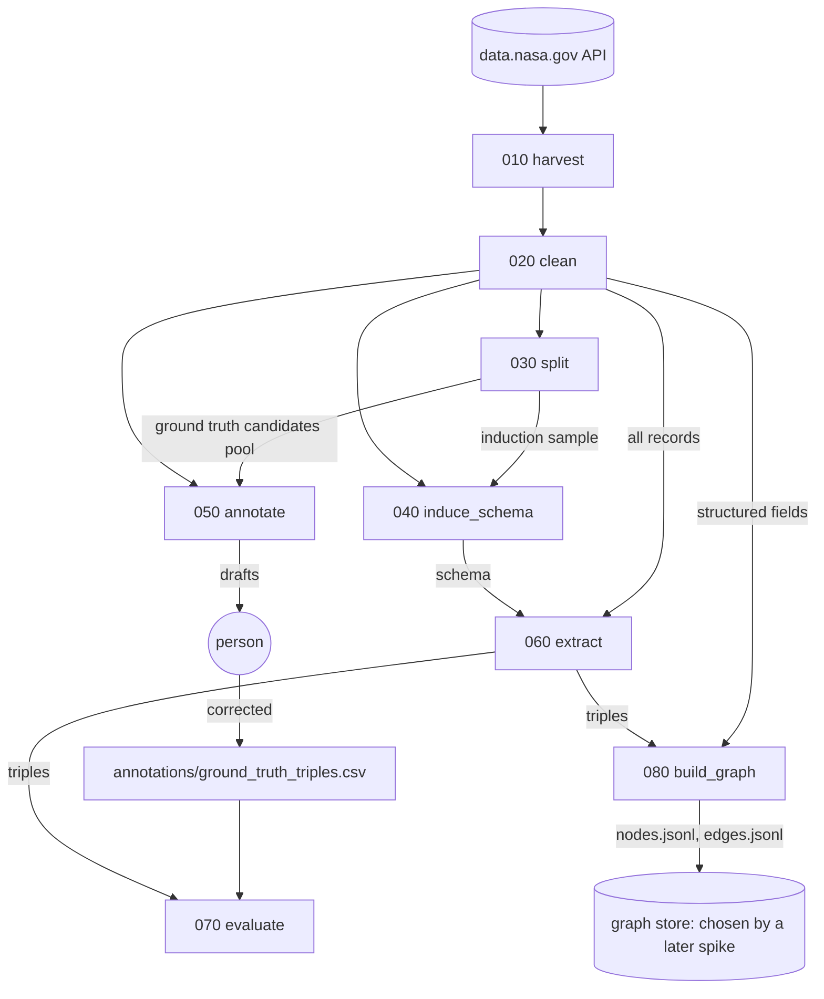

# Prompt: implement the data.nasa.gov knowledge-graph pipeline

Build a pipeline that turns the metadata of the [data.nasa.gov](https://data.nasa.gov) catalog into a knowledge graph. The catalog is a CKAN API with about 36,000 records. The pipeline:

1. harvests the catalog;
2. cleans the records;
3. sets aside two disjoint samples: one to induce the schema from, one to evaluate on;
4. induces a schema from the data with an LLM;
5. drafts ground-truth triples for a person to correct;
6. extracts schema-guided triples with an LLM (from every record once the schema is final; until then, only from the records that have ground truth);
7. scores the extraction against the ground truth;
8. builds the graph as nodes and edges, ready to load into a graph store (to be chosen; see step 080).

Implement it to the design below.

## Design goal

- **Linear pipeline.** Numbered steps. Each step reads earlier steps' outputs and writes its own.
- **Readable at a glance.** Each step is a short control panel showing only its main moves. The implementation lives in helper files.
- **Runnable whole or in part.** A master script runs everything in order; any single step runs on its own whenever its input files exist.
- **Observable and auditable.** Every run leaves a report, a log and a manifest. Every output item carries its own origin (the input item it came from), so it can be traced back to the API request that first returned it.
- **Rebuildable.** Everything a run produces lives in one folder that can be deleted and regenerated. Human work lives elsewhere and is never touched by the pipeline.

## Repository layout

```
run_pipeline.py                       master script
audit.py                              trace an item back to its source
010_harvest.py … 080_build_graph.py   control panels, one per step
010_harvest/ … 080_build_graph/       helpers for each step
common/                               code shared by two or more steps
instructions/                         one guide per step, plus 000_pipeline.md and 000_audit.md
annotations/                          human work, in Git, never written by the pipeline
outputs/                              everything a run produces, gitignored
    intermediate_results/NNN_name/    each step's output files (each item carries its origin), _manifest.json
    reports/                          one Markdown report per run
    logs/                             one log per run
```

## Core components

### 1. Steps

| Step | Does | Reads | Writes |
|---|---|---|---|
| `010_harvest` | Downloads every catalog record, page by page | the CKAN API | `batch_*.json`: one file per page, holding the raw records and the request that returned them |
| `020_clean` | Turns HTML in text fields into plain text and checks that no word, number or URL is lost; joins spellings of the same maintainer; keeps each field under its own key | 010 | `records.jsonl` |
| `030_split` | Sets two disjoint samples: the **ground truth candidates pool** (1,000 records, stratified by maintainer, shuffled so any first *k* is a fair sample) and the **induction sample** (from the largest maintainers). Write-once | 020, `annotations/ground_truth_candidates.csv` | `splits.json` |
| `040_induce_schema` | LLM extracts facts with no schema, labels each name, merges synonymous labels. Code counts support in distinct texts and maintainers and keeps entries above a threshold. LLM writes definitions; code rechecks every number | 020, 030 | `the_schema.json`, `induction_evidence.json` |
| `050_annotate` | LLM drafts triples for the next records in the ground truth candidates pool; a person corrects them into `annotations/` | 020, 030, `annotations/schema_derived_from_manual_annotation.txt` | `drafted_triples.csv` |
| `060_extract` | LLM extracts triples that follow the schema, from **every** record once the schema is final (until then, only from the records that have ground truth, to limit cost); code checks each one and keeps or removes it, with a reason | 020, 040 | `extracted_triples.csv`, `extracted_triples_removed.csv` |
| `070_evaluate` | Precision and recall on the records of the ground truth candidates pool that a person has corrected, overall and per maintainer | `annotations/ground_truth_triples.csv`, 060 | `metrics.json`, per-record diff |
| `080_build_graph` | Builds the graph from the structured facts (maintainers, keywords, formats) and the extracted triples, in a store-neutral form | 020, 060 | `nodes.jsonl`, `edges.jsonl` |

**Rule:** a step reads only from earlier steps' output folders (or `annotations/`), and writes only to its own.

**The ground truth candidates pool.** 1,000 records that are candidates for annotation: a person annotates them in pool order, and the annotated records become the ground truth. Only a subset of the pool is ever annotated, since verifying 1,000 records by hand is more than the time available; because the pool is shuffled, the first *k* records are a fair sample of the catalog for any *k*, so annotation can stop anywhere. The pool was drawn once, on 2026-09-21, and is kept in `annotations/ground_truth_candidates.csv`; 030 reads it and never redraws it.

**Why the two samples must be disjoint.** 070 measures how well extraction works on text the schema was *not* learned from; scoring on induction texts would flatter the schema. Once the schema is final, extraction runs on every record, because the graph needs every record, including the ground truth candidates pool, whose annotated records are what 070 scores.

**Graph store: open.** 080 writes nodes and edges as files, not into a database. Which store to load them into (a property graph such as Neo4j, an RDF triple store, an embedded graph database, or plain files and a dataframe library) is decided later by a spike that weighs scale (on the order of 100k nodes and 1M edges), query needs and cost. Loading becomes its own step once that's settled.



### 2. Control panel: `NNN_name.py`

Anyone should understand a step in under a minute from its control panel alone, without opening a helper file.

```python
"""
040 · Induce schema

Learns the graph's vocabulary (entity classes, predicates, patterns) from the
catalog itself.

Reads:   cleaned records (020), induction split (030)
Writes:  the_schema.json, induction_evidence.json
Details: instructions/040_induce_schema.md
"""
from common.step import run_step, helpers

INPUTS = {
    "records": "020_clean/records.jsonl",
    "splits":  "030_split/splits.json",
}

SETTINGS = {
    "texts_per_maintainer": 15,  # texts sampled from each maintainer
    "min_support":          3,   # an entry must appear in this many texts to be kept
    "synonym_rounds":       1,   # extra passes to catch synonyms split across batches
}

induce = helpers("040_induce_schema")

def main(inputs, settings, output):
    texts  = induce.pick_texts(inputs, settings)       # the induction split
    facts  = induce.extract_facts(texts)               # LLM: "MODIS is aboard Aqua"
    labels = induce.label_names(facts)                 # LLM: MODIS → Instrument
    labels = induce.merge_synonyms(labels, settings)   # LLM: Sensor = Instrument
    counts = induce.count_support(facts, labels)       # code: texts behind each entry
    schema = induce.write_schema(counts, settings)     # LLM: definitions, examples
    induce.check_schema(schema, counts)                # code: recheck the LLM's numbers
    return induce.results(schema, counts, output)      # save files; report numbers, warnings

if __name__ == "__main__":
    run_step("040_induce_schema", INPUTS, SETTINGS, main)
```

| A control panel has | A control panel never has |
|---|---|
| A docstring: what, reads, writes, and a pointer to its instructions file | Loops, parsing, prompts, `try/except`, `argparse`, `print` |
| `INPUTS`: the files it reads, as paths relative to `outputs/intermediate_results/`; a path starting `./` is relative to the repo root | File paths anywhere else |
| `SETTINGS`: only knobs a person tunes, each with a comment | Constants nobody tunes (batch sizes, timeouts) |
| `main()`: one line per move, named in project words, with an example comment | Imports from its helper folder other than `moves.py` |

Keep it under about 40 lines.

### 3. Step helpers: `NNN_name/`

- `moves.py` exposes one function per main move. It is the only file the control panel uses.
- The other files hold the implementation (API client, prompts, parsing, caching…) and import each other by plain name.
- `helpers("NNN_name")` loads `moves.py` by file path, because a folder name starting with a digit can't be imported the normal way. Every move called through it is timed and logged automatically.
- `main` returns a `Results` object: files written, headline numbers, the Markdown for the report's Results section, and warnings. 010 also sets the harvest date.

### 4. Shared code: `common/`

| File | Holds |
|---|---|
| `step.py` | `run_step`, `helpers`, `Results`, and the folder locations |
| `report.py` | the step report |
| `audit.py` | run ids, logging, move timing, and `origin()`, which builds an item's origin reference |
| `trace.py` | follows origin references upstream, for `audit.py` |
| `llm.py`, `records_io.py`, `triples_io.py`, `chunking.py` | the LLM client and the I/O shared by several steps |

**Rules:** a file goes in `common/` only when two or more steps use it. `common/` never imports from a step, and no step imports from another step's folder.

`run_step(name, INPUTS, SETTINGS, main)` does everything that is the same for every step:

1. Reads the command line: `--<input> PATH` replaces an input, `--<setting> VALUE` changes a setting.
2. Creates the run id and opens the log.
3. Checks that every input file exists. If one is missing, it stops and names the file and the step that produces it. For each input, it records the hash and the run that produced it; a missing manifest beside an input is a warning, not a stop, except for a file kept in Git (e.g. in `annotations/`), which is made by a person and has none.
4. Creates the output folder.
5. Calls `main(inputs, settings, output)`.
6. Writes the manifest and the report.
7. On any failure: logs the full traceback, writes a report marked "failed" with the one-line cause, and exits non-zero.

### 5. Master script: `run_pipeline.py`

- Holds the step list, written out in order: `010_harvest` … `080_build_graph`.
- Supports `--from NNN`, `--to NNN` and `--only NNN`.
- Runs each step in its own process and stops at the first failure.
- Checks each step's inputs before starting it.
- Keeps write-once outputs (030's splits), marking the step "kept".
- Skips 070, with a note rather than a failure, until `annotations/ground_truth_triples.csv` exists.
- Writes `outputs/reports/000_pipeline_<datetime>.md` and its own log. The master report has three sections:

| Section | Contents |
|---|---|
| **Run** | times, total duration, git commit, harvest date, steps requested |
| **Pipeline at a glance** | one row per step: status (ran / kept / skipped / failed), duration, one or two headline numbers, warning count, link to the step's report |
| **Needs attention** | the failure with links to its report and log; steps with warnings; the skipped 070 |

The master report reads headline numbers from each step's manifest, and never repeats the step reports' content.

### 6. Running a step on its own

```
py 060_extract.py                                         default inputs
py 060_extract.py --schema annotations/schema_derived_from_manual_annotation.txt   one input swapped
py 040_induce_schema.py --min_support 5                   one setting changed
```

- A step checks its input files, never earlier steps, and never runs them for you.
- It writes its own output, report and log as usual; there is no master report.
- `instructions/` and the README include the table of required inputs per step.

### 7. Step report: `outputs/reports/<run id>.md`

Every report has the same sections:

| Section | Contents |
|---|---|
| **Run** | run id, status, times, duration, git commit, harvest date, link to the log |
| **Settings** | values used, marking any changed on the command line |
| **Inputs** | path, file count, producing run, hash |
| **Outputs** | file, size, hash |
| **Timeline** | each move and its duration |
| **Results** | headline numbers and the step's own table |
| **Warnings** | one line each, or "None." |

### 8. Step instructions: `instructions/NNN_name.md`

Each step's instructions file has these sections: Purpose, Inputs, Outputs (with an example item), Settings (meaning, default, when to change), How to run, How it works (one paragraph per move), Checks and warnings (message, meaning, what to do), Human work, and Known limits.

The control panel's docstring is the summary; the instructions file is the full guide. A change to a step's inputs, outputs or settings updates its instructions file in the same commit.

### 9. Observability and audit

Every run answers three questions:

| Question | Answered by |
|---|---|
| What happened, in what order? Why did it fail? | **log**, `outputs/logs/<run id>.log` (one per run) |
| Exactly which files went in and came out? | **manifest**, `_manifest.json` (one per step folder) |
| Where did this item come from? | **origin**, carried by the item itself, inside the output file |

- **Run id:** `<step>_<YYYY-MM-DD_HHMM>`, plus `-2`, `-3`… for more runs in the same minute. It names the report and the log, and is recorded in the manifest. It has no colons, so the name is valid on Windows.
- **Log:** one line per event, with a millisecond timestamp, level, step and message.
  - `run_step` logs the command line, git commit, Python version, settings, inputs with their hashes, each move with its duration, outputs with their hashes, warnings, the status, and the traceback on failure.
  - The helpers log step detail. For 010 that's every request (URL, status, size, time) and every retry.
  - The console shows INFO and above; the file keeps DEBUG.
- **Manifest:** the run id, times, git commit, settings, inputs (path, sha256, producing run id), outputs (file, size, sha256), headline numbers, warning count, harvest date (carried forward from 010), and the report and log paths. The manifest is the per-file half of the audit trail. Hashes and producing runs are recorded here once per file, not repeated on every item.
- **Origin:** the per-item half. There is no separate lineage file; each output item names the input item(s) it came from, in the same file:
  - JSON output: an `_origin` field. CSV output: an `origin` column.
  - The value is a list of references `<step>/<file>#<key>`, or `#<position>` when the item has no key:

    ```json
    {"id": "a1b2…", "title": "…", "notes": "…", "maintainer": "…",
     "_origin": ["010_harvest/batch_00000.json#412"]}
    ```

    ```
    subject,predicate,object,record_id,origin
    MODIS,ABOARD,Aqua,a1b2…,"020_clean/records.jsonl#a1b2…; 040_induce_schema/the_schema.json#ABOARD"
    ```
  - 010 is where origin starts: each batch file wraps its raw records with the request that returned them, and the records themselves are left exactly as the API sent them:

    ```json
    {"request": "GET https://data.nasa.gov/api/3/action/package_search?rows=1000&start=0",
     "fetched_at": "2026-09-27T10:16:03-07:00", "http_status": 200, "catalog_count": 36388,
     "records": [ …raw CKAN records… ]}
    ```
  - `origin(input_name, key_or_position)` in `common/audit.py` builds a reference, so adding origin is one line per item.
  - Each step checks that every output item has an origin, and warns if not.
- **`audit.py <key>`**: finds the item in the latest step that has it, then follows its origin references upstream, step by step, to the 010 request. Each hop shows the run that made it, with its report and log. By comparing each input's current hash with the hash in the manifest, it flags items made from a file that has since changed.
- **Paths** in manifests, origins and reports always use forward slashes, relative to the repo root, so they trace on any operating system.

### 10. Outputs, reruns and human work

- `outputs/` is gitignored. It can be deleted and rebuilt, but a rebuild is not identical: the catalog changes and LLM answers vary. Archive any harvest you've cited before deleting it.
- Output files keep fixed names. A rerun overwrites its step's output; the report and log of every run are kept.
- Exceptions are write-once outputs: 030's splits, because re-drawing them would invalidate annotation in progress.
- `annotations/` holds human work (the annotation schema and the corrected ground truth). It is in Git, and no step writes to it.

### 11. Step 010 in detail

- **Settings:** `page_size` (default 1000), `max_records` (default 0, meaning the whole catalog; set it for quick trials), `pause_seconds` (default 0.5).
- **Requests:** `package_search` with `rows` and `start`. The first page gives the catalog count. Retry 5 times with backoff on 429 and 5xx responses.
- **Writes:** each page is written to a temporary file and renamed when complete, so a crash never leaves a half-written batch.
- **Reruns:**
  - keep a batch file whose record count fits this run's settings;
  - download again, and overwrite, one that doesn't fit;
  - delete batch files beyond this run's range.

  The folder then always holds exactly one harvest.
- **Checks:** the saved record count matches what the API reported; warn about repeated ids, since records added mid-harvest shift the pages.
- **Harvest date:** taken from the `fetched_at` of the batch files.

## How to build it

1. Build `common/` and `010_harvest` first. Test them against a local stand-in API: a full run, a crash followed by a resume, a trial run followed by a full run, a smaller `max_records` than what's on disk, a `page_size` change, and `audit.py` tracing a record.
2. Add the steps one at a time, in order. Each one is done when it has its control panel, helpers, origin on every output item, report results, instructions file, and a test run.
3. Add `run_pipeline.py` last, and check that a full run matches running the steps one by one.
4. Ask me before choosing anything the design leaves open: which schema 060 uses by default, and whether to commit `outputs/reports/`. The graph store is a separate spike, not part of this build.
5. Never `git add`, commit or push without my review.
