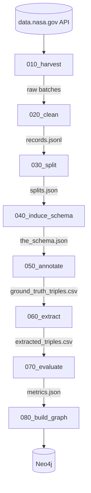
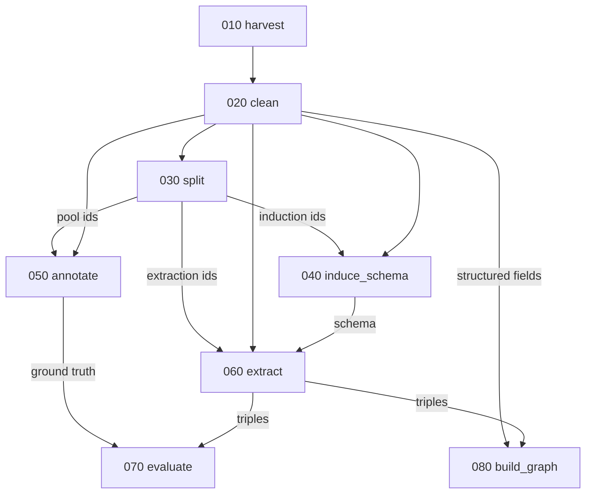
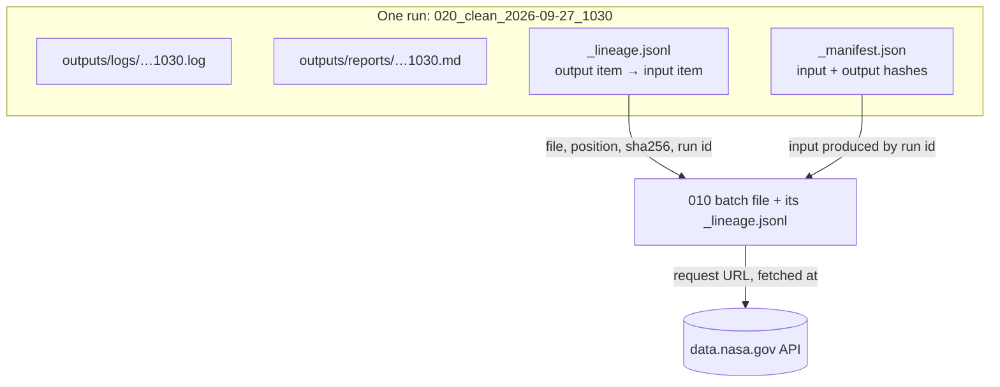

# Pipeline redesign plan

Branch: `design-refactoring` · Reviewed at commit `e7d6a16` · Design only, no code changed.

## 1. Goal

Turn the loose set of scripts into a numbered, linear pipeline:

- Each step has one **input** (earlier steps' outputs) and one **output folder** in `outputs/intermediate_results/`.
- Each step also writes a human-readable **report** to `outputs/reports/`.
- Each step has a short **control panel** script (`NNN_name.py`) that shows only the main moves and the settings you would change.
- Implementation details live in a folder with the same name (`NNN_name/`).
- Helper files used by more than one step live in a single `common/` folder (§6).
- A master script, `run_pipeline.py`, calls all steps in the right sequence (§4).
- Any step can also run on its own, as long as its input files exist (§5).
- Each step has its own instructions file, `instructions/NNN_name.md` (§5).
- Every run is observable and auditable: a log file in `outputs/logs/`, and a lineage file linking each output item to the input it came from (§9).
- Everything a run produces lives under one folder, `outputs/`, which can be deleted and rebuilt. Human work that can't be rebuilt lives in `annotations/`, in Git (§7).

## 2. What exists today

| Script | Lines | Does | Reads | Writes |
|---|---:|---|---|---|
| `nasa_harvest.py` | 68 | Downloads the CKAN catalog in pages | data.nasa.gov API | `data/batch_*.json` |
| `nasa_census.py` | 51 | Counts field fill rates and distinct values | `data/batch_*.json` | console only |
| `note_cleaning.py` | 1067 | HTML → plain text, with a no-content-lost check | (library) | — |
| `build_inputs.py` | 424 | Cleans title/notes, joins maintainer spellings | `data/batch_*.json` | `inputs.json` |
| `ground_truth_sampler.py` | 252 | Draws the fixed 1,000-record annotation pool | `inputs.json` | `ground_truth_sample_outputs/ground_truth_pool.{csv,json}` |
| `best_induce_schema.py` | 1858 | 6-stage schema induction (LLM) **and** the Ask Sage client | `inputs.json` | `the_schema.json`, `induction_evidence.json`, `induction_cache/` |
| `extract_triples_for_kg.py` | 490 | Schema-guided extraction + code checks | `inputs.json`, a schema | `extraction_outputs/extracted_triples*.csv`, `.run.json` |

### Problems the redesign fixes

1. **Missing from the repo.** Imported or named but not committed: `inputs_io.py`, `triple_io.py`, `validate_triples.py`, `draft_ground_truth_triples.py`, `list_models.py`, `rank_check.py`, `scorer.py`, `load_into_graph_database.py`, `schema_derived_from_manual_annotation.txt`, and the phase 1 graph loader. A fresh clone cannot run steps 3 onward.
2. **Hidden coupling.** `extract_triples_for_kg.py` imports the LLM client from `best_induce_schema.py` and chunking from `draft_ground_truth_triples.py`. Changing the schema script can break extraction.
3. **Outputs scattered.** `inputs.json` at the root, four different output folders, no record of which harvest a result came from.
4. **Sampling in two places.** The ground-truth pool and the induction sample are drawn by different scripts with different seeds; nothing guarantees they don't overlap.
5. **One 1,858-line file** holds six stages, caching, prompts, verification and the model client (already a TODO item).
6. **Name drift.** README says `induce_schema.py`, `extract_triples.py`; files are `best_induce_schema.py`, `extract_triples_for_kg.py`.

## 3. The pipeline



| Step | Main job | Input | Output (`outputs/intermediate_results/NNN_name/`) | Comes from |
|---|---|---|---|---|
| **010_harvest** | Download the catalog snapshot | API | `batch_*.json` | `nasa_harvest.py` |
| **020_clean** | Clean text fields, join maintainer spellings, keep structured fields | 010 | `records.jsonl` | `build_inputs.py`, `note_cleaning.py` |
| **030_split** | Decide, once, which records are for induction, annotation, and extraction | 020 | `splits.json` (frozen) | `ground_truth_sampler.py` + `stratified_sample()` from induction |
| **040_induce_schema** | Derive the schema from the induction split | 020, 030 | `the_schema.json`, `induction_evidence.json` | `best_induce_schema.py` |
| **050_annotate** | Draft triples for the pool; a human corrects them | 020, 030, annotation schema | `drafted_triples.csv`; the corrected copy goes to `annotations/` (§7) | `draft_ground_truth_triples.py` |
| **060_extract** | Extract schema-guided triples, validate in code | 020, 030, 040 | `extracted_triples.csv` (+ removed, run settings) | `extract_triples_for_kg.py`, `validate_triples.py` |
| **070_evaluate** | Precision / recall vs ground truth | 050, 060 | `metrics.json`, per-record diff | `scorer.py` |
| **080_build_graph** | Load structured facts (phase 1) + text facts (phase 2) | 020, 060 | Neo4j + load report | `load_into_graph_database.py`, phase 1 loader |

**Off the chain** (`analysis/`): `census.py`, `rank_check.py`, `list_models.py`. They inform decisions but feed no step.

### Honest note on "linear"

The run order is strictly linear, but the data is not: annotation (050) doesn't use the induced schema, and scoring needs both 050 and 060. The rule that keeps it simple:

> **A step reads only from earlier steps' folders and writes only to its own.** It never reaches forward, and never writes into another step's folder.

The real dependencies:



## 4. Master script

One script at the repo root, `run_pipeline.py`, calls every step in the right order. It is the control panel for the whole pipeline: the step list is written out in it, so the order is visible at a glance.

```python
STEPS = ["010_harvest", "020_clean", "030_split", "040_induce_schema",
         "050_annotate", "060_extract", "070_evaluate", "080_build_graph"]
```

```
py run_pipeline.py                     all steps, 010 → 080
py run_pipeline.py --from 040          040 onward
py run_pipeline.py --from 040 --to 060 a range
py run_pipeline.py --only 070          one step
```

How it runs:

- **In order, stop on failure.** Each step runs to completion before the next starts. If one fails, later steps don't run, and the master says which step failed and where its report is.
- **Each step in its own process** (`py NNN_name.py`). Steps stay independent, and one step's import-path setup (§5) can't leak into another.
- **Input check.** Before starting a step, the master runs the same input check the step does on its own (§5). `--from 060` on a fresh clone stops with a clear message instead of a stack trace.
- **Frozen steps are kept.** If `030_split` or `050_annotate` output already exists, the master leaves it alone and marks the step "kept".
- **Human gate.** `070_evaluate` needs hand-corrected ground truth. Until that file exists, the master skips 070 with a note and carries on to 080; it doesn't fail.
- **Its own report.** Each run writes an end-to-end master report (below).

Each step can also be run on its own when its input files exist (§5, "Running a step on its own").

### Master report

```
outputs/reports/000_pipeline_YYYY-MM-DD_HHMM.md
outputs/logs/000_pipeline_YYYY-MM-DD_HHMM.log      the master's own log: each step started, finished, status
```

One page that shows the whole run at a glance and links to the step reports for details. It never repeats their content.

| Section | Contents |
|---|---|
| **Run** | start/end time, total duration, git commit, harvest date, steps requested (`--from`/`--to`/`--only`) |
| **Pipeline at a glance** | one row per step: status (ran / kept / skipped / failed), duration, 1–2 headline numbers, warning count, link to that step's report |
| **Needs attention** | the failed step, its error line, and links to its report and log; every step with warnings; the human gate if 070 was skipped. "Nothing" if clean |

Headline numbers per step:

| Step | Headline |
|---|---|
| 010_harvest | records harvested |
| 020_clean | records written, maintainers after joining |
| 030_split | induction / pool / extraction sizes |
| 040_induce_schema | classes, predicates, patterns kept |
| 050_annotate | records drafted, records corrected |
| 060_extract | triples kept, triples removed |
| 070_evaluate | precision, recall |
| 080_build_graph | nodes, relationships |

Example row:

```
| 060_extract | ran | 42 min | 18,406 triples kept, 1,212 removed | 3 | [report](060_extract_2026-09-26_1855.md) |
```

Each step puts its headline numbers and warning count in its `_manifest.json`, so the master reads them from there rather than parsing Markdown. For a step marked "kept" or "skipped", the link points to that step's most recent report.

## 5. Control panels

**The goal:** open any `NNN_name.py` and understand the step in under a minute, without opening a helper file. The control panel says *what* happens and in what order; the helper folder says *how*.

### Layout of a step

```
040_induce_schema.py              ← control panel, ~30 lines
040_induce_schema/                ← helpers, never run directly
    moves.py                      ← the only file the panel uses: one function per main move
    sample.py  extract.py  label.py  synonyms.py  support.py
    assemble.py  verify.py  prompts.py  cache.py
instructions/040_induce_schema.md         ← instructions for people, in Git
outputs/intermediate_results/040_induce_schema/   ← output (gitignored)
outputs/reports/040_induce_schema_<datetime>.md   ← report
```

`moves.py` is the boundary: it exposes the step's main moves in plain names and hides everything else in the folder. The panel never imports anything else from the folder.

### What a control panel looks like

Full example, 040:

```python
"""
040 · Induce schema

Learns the graph's vocabulary (entity classes, predicates, patterns) from the
catalog itself: pull facts out of sample texts with no schema imposed, give
each name a general label, merge labels that mean the same thing, and keep
only what recurs across many texts.

Reads:   cleaned records (020), induction split (030)
Writes:  the_schema.json, induction_evidence.json
Details: instructions/040_induce_schema.md
"""
from common.step import run_step, helpers

INPUTS = {
    "records": "020_clean/records.jsonl",
    "splits":  "030_split/splits.json",
}

SETTINGS = {
    "texts_per_maintainer": 15,  # texts sampled from each maintainer
    "min_support":          3,   # a class must appear in this many texts to be kept
    "synonym_rounds":       1,   # extra passes to catch synonyms split across batches
}

induce = helpers("040_induce_schema")

def main(inputs, settings, output):
    texts  = induce.pick_texts(inputs, settings)       # the induction split
    facts  = induce.extract_facts(texts)               # LLM: "MODIS is aboard Aqua"
    labels = induce.label_names(facts)                 # LLM: MODIS → Instrument
    labels = induce.merge_synonyms(labels, settings)   # LLM: Sensor = Instrument
    counts = induce.count_support(facts, labels)       # code: texts behind each entry
    schema = induce.write_schema(counts, settings)     # LLM: definitions, examples
    induce.check_schema(schema, counts)                # code: recheck the LLM's numbers
    return induce.results(schema, counts, output)      # save files; report numbers, warnings

run_step("040_induce_schema", INPUTS, SETTINGS, main)
```

### Rules for every control panel

| A control panel has | A control panel never has |
|---|---|
| A docstring: what, why, reads, writes, and a pointer to its instructions file | Loops, parsing, regexes, prompts |
| `INPUTS`: the files it reads | File paths anywhere except `INPUTS` |
| `SETTINGS`: only knobs a person tunes, each with a one-line comment | Constants nobody tunes (batch sizes, timeouts): those live in the helpers |
| `main()`: one line per main move, with a comment giving an example | `try`/`except`, `argparse`, `print`, caching, retries, model-client details |
| One `return` of results | Imports from the helper folder other than `moves.py` |

Two more:

- **Under ~40 lines.** If a move needs a second line, it becomes one function in `moves.py`.
- **Moves are named in project words**, not mechanics: `label_names`, not `stage3_batched_call`. The comment shows a real example of what the move does.

### What `run_step` does, so the panel doesn't have to

`run_step` (in `common/step.py`) wraps every step the same way:

1. Reads the command line: `--records PATH` overrides an input, `--min_support 5` overrides a setting.
2. Gives the run its run id and opens its log file (§9).
3. Checks that every input file exists; stops with a clear message if not. Records each input's hash and the run that produced it.
4. Creates the output folder and opens its lineage file.
5. Calls `main(inputs, settings, output)`, where `output` is the step's folder in `outputs/intermediate_results/`. The helpers write the step's files there themselves (some steps, like 010, save as they go). Every move is timed and logged, without any code in the panel.
6. Writes `_manifest.json` (with output hashes) and the step report.
7. On an error: logs the full traceback, writes a report marked "failed" with the one-line cause, and exits with an error code, so the master script stops.

`main` returns a `Results` object (from `common/step.py`) with: the files written, headline numbers, the report's Results section, warnings, and, for 010 only, the harvest date.

`INPUTS` paths are relative to `outputs/intermediate_results/`. A path starting with `./` is relative to the repo root (for files kept in Git, like `./annotations/ground_truth_triples.csv`). Paths passed on the command line are ordinary paths.

### The other control panels, `main()` only

```python
# 010_harvest
pages   = harvest.download_catalog(settings)            # CKAN API, page by page, resumable
harvest.check_complete(pages)                           # saved count = count the API reports
return harvest.results(pages)

# 020_clean
records = clean.load_raw(inputs)                        # batch files → one list
records = clean.clean_text(records)                     # HTML → plain text, nothing lost
records = clean.join_maintainers(records)               # "KRISTAN MORGAN" = "Kristan Morgan"
records = clean.keep_fields(records, settings)          # title, notes + structured fields
return clean.results(records)

# 030_split
records = split.load_records(inputs)
pool    = split.ground_truth_pool(records, settings)    # 1,000, by maintainer; kept if it exists
induct  = split.induction_sample(records, pool, settings)  # top maintainers, none from pool
rest    = split.extraction_set(records, pool, induct)   # everything else
split.check_no_overlap(pool, induct, rest)
return split.results(pool, induct, rest)

# 050_annotate
records = annotate.next_pool_records(inputs, settings)  # next N not yet annotated, in pool order
drafts  = annotate.draft_triples(records, inputs)       # LLM proposes; a person corrects
return annotate.results(drafts)                         # never overwrites corrected triples

# 060_extract
records = extract.pick_records(inputs, settings)        # extraction split, or chosen ids
triples = extract.extract_triples(records, inputs)      # LLM, following the schema
kept, removed = extract.check_triples(triples, inputs)  # code: well-formed? fits the schema?
return extract.results(kept, removed)

# 070_evaluate
truth  = evaluate.load_truth(inputs)                    # only records a person finished
found  = evaluate.load_found(inputs, truth)             # the same records, from 060
scores = evaluate.compare(truth, found)                 # precision, recall, per maintainer
return evaluate.results(scores)

# 080_build_graph
facts  = graph.structured_facts(inputs)                 # phase 1: maintainers, keywords, formats
facts += graph.text_facts(inputs)                       # phase 2: extracted triples
graph.load(facts, settings)                             # into Neo4j
return graph.results(facts)
```

**Python note:** a folder name starting with a digit can't be imported the normal way (`import 040_induce_schema` is a syntax error). `helpers("040_induce_schema")` loads that folder's `moves.py` by file path and lets the files inside the folder import each other normally. Since every step runs in its own process, helper file names only need to be unique within their folder and `common/`.

### Running a step on its own

Any step runs by itself whenever its input files exist, however they got there: an earlier pipeline run, a teammate's copy, or a file you made by hand.

```
py 060_extract.py                                          reads the default inputs
py 060_extract.py --schema annotations/annotation_schema.txt   one input swapped
py 040_induce_schema.py --min_support 5                    one setting changed
py 070_evaluate.py --extracted old_runs/extracted_triples.csv   compare an older run
```

Rules:

- **Inputs are files, not steps.** A step checks that each file in its `INPUTS` block exists, and nothing else. It never runs an earlier step for you.
- **Missing input → clear stop.** The message names each missing file and the step that produces it, e.g. `missing outputs/intermediate_results/040_induce_schema/the_schema.json — run 040_induce_schema first, or pass --schema`.
- **Any input can be swapped.** Every key in `INPUTS` is also a command-line option of the same name (`--records`, `--splits`, `--schema`, …). Defaults point into `outputs/intermediate_results/`.
- **Missing manifest → warning, not stop.** If an input came from outside the pipeline (no `_manifest.json` beside it), the step still runs; its report marks that input's origin as unknown.
- **Output and report as usual.** A standalone run writes to its own output folder and its own report. No master report is written.

What each step needs:

| Step | Required input files (defaults) |
|---|---|
| 010_harvest | none (reads the API) |
| 020_clean | `010_harvest/batch_*.json` |
| 030_split | `020_clean/records.jsonl` |
| 040_induce_schema | `020_clean/records.jsonl`, `030_split/splits.json` |
| 050_annotate | `020_clean/records.jsonl`, `030_split/splits.json`, `./annotations/annotation_schema.txt` (in Git) |
| 060_extract | `020_clean/records.jsonl`, `030_split/splits.json`, `040_induce_schema/the_schema.json` |
| 070_evaluate | `./annotations/ground_truth_triples.csv` (in Git), `060_extract/extracted_triples.csv` |
| 080_build_graph | `020_clean/records.jsonl`, `060_extract/extracted_triples.csv` |

Paths are under `outputs/intermediate_results/` unless marked "in Git". The same table goes in the README's "How to reproduce" section.

### Step instructions

Each step has one Markdown file of instructions, and so does the master script:

```
instructions/
    000_pipeline.md          how to run everything, --from/--to/--only, what the master report shows
    000_audit.md             reports, logs, manifests, lineage, and tracing an item with audit.py
    010_harvest.md
    020_clean.md
    ...
    080_build_graph.md
```

The control panel's docstring is the one-paragraph summary; the instructions file is the full guide. Every file has the same sections:

| Section | Contents |
|---|---|
| **Purpose** | what the step does and why the pipeline needs it |
| **Inputs** | each `INPUTS` file: where it comes from, what's in it |
| **Outputs** | each output file: format, one example row |
| **Settings** | each setting: meaning, default, when you'd change it |
| **How to run** | as part of the pipeline, on its own, with inputs or settings swapped |
| **How it works** | the main moves in order, in plain words, one short paragraph each |
| **Checks and warnings** | what the step verifies, what each warning means, what to do about it |
| **Human work** | only where a person acts (050: how to correct drafts; 070: when ground truth is ready) |
| **Known limits** | open issues, e.g. 040's alphabetical synonym batches |

Much of this already exists in the long header comments of today's scripts (`best_induce_schema.py` has ~250 lines of it, `ground_truth_sampler.py` ~100). Those comments move into the instructions files, so the control panels stay short.

**Kept current:** a change to a step's inputs, outputs or settings updates its instructions file in the same commit.

## 6. Shared code: `common/`

Helper files used by more than one step are stored in one folder at the repo root, `common/`. Starting contents:

```
common/
    llm.py          Ask Sage client, retries, JSON parsing   (now inside best_induce_schema.py)
    records_io.py   load records.jsonl, filter by split      (now inputs_io.py)
    triples_io.py   read/write/clean triple CSVs             (now triple_io.py)
    chunking.py     split long texts                         (now in draft_ground_truth_triples.py)
    step.py         run_step (command line, input check, manifest, report, errors) and helpers()
    report.py       the step report (see §8)
    audit.py        run ids, log files, move timing, lineage writer (see §9)
    trace.py        follows an item's lineage upstream, for audit.py (see §9)
    settings.py     MODEL, data root, snapshot id
```

Rules:

- A file goes in `common/` only when **two or more** steps use it. Code used by one step stays in that step's folder.
- Steps import from `common/`; `common/` never imports from a step folder. This is what stops one step's change from breaking another (problem 2 in §2).
- A step never imports from another step's folder. If two steps need the same code, it moves to `common/`.

## 7. Data layout and lineage

The repo holds two kinds of things, kept apart:

```
010_harvest.py … 080_build_graph.py      control panels          ┐
010_harvest/ … 080_build_graph/          helpers                 │
common/  instructions/  docs/            shared code, docs       ├ in Git: written by people
annotations/                             human work, see below   ┘
    annotation_schema.txt
    ground_truth_triples.csv

outputs/                                 everything a run makes  ─ gitignored: rebuilt by running
    intermediate_results/                                            the pipeline (replaces data/)
        010_harvest/   batch_*.json   _manifest.json  _lineage.jsonl
        020_clean/     records.jsonl  _manifest.json  _lineage.jsonl
        ...
    reports/          one per run, for people
        010_harvest_2026-08-30_1412.md
    logs/             one per run, same name as its report
        010_harvest_2026-08-30_1412.log
```

**`outputs/`** can be deleted at any time for a clean start: one `.gitignore` line covers it. Two cautions:

- **Rebuilt is not identical.** The catalog changes weekly and LLM steps can answer differently on a rerun. Before deleting a harvest you've cited in results, archive it (e.g. zip `outputs/` with the harvest date in the name).
- **Human work never goes in `outputs/`.** Hand-corrected ground truth took hours and can't be regenerated. 050 writes its LLM drafts to `outputs/intermediate_results/050_annotate/`; the corrected file lives in `annotations/`, in Git, and 070 reads it from there. No step writes into `annotations/`.

Output files keep fixed names (`records.jsonl`, not `records_<datetime>.jsonl`), so the next step always knows what to read. A rerun replaces the output; the report and log of every run are kept.

Every step writes `_manifest.json`: run id, step name, start/end time, settings used, input files with hashes and the run that produced each, output files with sizes and hashes, headline numbers and warning count (for the master report, §4), git commit, the harvest date carried forward from 010, and the names of the run's report and log. This answers "which harvest is this schema from?" — the README's timing note, made automatic.

A step checks its input files before running, not the manifests; a missing manifest only marks that input's origin as unknown in the report (§5).

**Frozen outputs.** `030_split` and `050_annotate` are write-once: they refuse to overwrite, as `ground_truth_sampler.py` does today. Re-harvesting must not reshuffle the annotation pool.

## 8. Step reports

Every step, on every run, writes a Markdown report next to its regular output. These are the detail reports the master report (§4) links to:

```
outputs/reports/<run id>.md        e.g. outputs/reports/060_extract_2026-09-26_1855.md
```

The run id is the step name plus the run's start time, local, without colons so the name is valid on Windows. A second run in the same minute gets `-2`. Names sort by step, then by time.

The manifest is for code (is upstream done, which inputs); the report is for people. Every report has the same sections, filled by `common/report.py`:

| Section | Contents |
|---|---|
| **Run** | run id, start/end time, duration, git commit, harvest date, links to the log and the lineage file |
| **Settings** | the control panel's settings block, as used |
| **Inputs** | files read, their hash, and the run that produced them |
| **Outputs** | files written, sizes, hashes |
| **Timeline** | each move and how long it took |
| **Results** | the step's own numbers (below) |
| **Warnings** | anything the step flagged; "none" if nothing |

What **Results** holds, per step:

| Step | Results |
|---|---|
| 010_harvest | records reported vs saved, batch count, empty pages |
| 020_clean | records written, cleaning tier counts (parsed / conservative / source), maintainers before → after joining |
| 030_split | size of each split, places per maintainer group, overlap check (must be 0) |
| 040_induce_schema | classes / predicates / patterns kept and deferred, single-maintainer entries, verification corrections |
| 050_annotate | records drafted, records human-corrected so far |
| 060_extract | records processed, triples kept, triples removed by reason, model errors |
| 070_evaluate | precision, recall, per-maintainer breakdown |
| 080_build_graph | nodes and relationships loaded, by label and type |

Much of this is printed to the console today (e.g. `build_inputs.py`'s tier counts, the induction group-coverage summary); the report makes it permanent. `build_inputs_report.json` becomes part of 020's report.

## 9. Observability and audit

Three questions every run must be able to answer, long after it ran:

| Question | Answered by |
|---|---|
| What happened, in what order, and why did it fail? | the **log**, `outputs/logs/<run id>.log` |
| Which files went in and came out, exactly? | the **manifest**: every input and output with its sha256 hash, and the run that produced each input |
| Where did this particular item come from? | the **lineage**, `_lineage.jsonl`: one row per output item, naming the input item(s) it came from |

### Run id

Every run gets one id, e.g. `010_harvest_2026-09-27_1016`, used for its log, its report and its manifest. From any one of them you can find the other two.

### Logs

`outputs/logs/<run id>.log`, one per run, kept like reports. Each line has the time (to the millisecond), level, step and message:

```
2026-09-27 10:16:03.412  INFO     010_harvest  -- download_catalog
2026-09-27 10:16:04.735  DEBUG    010_harvest  GET https://data.nasa.gov/...&start=1000 -> 200, 3,412,118 bytes in 1.32 s
2026-09-27 10:16:04.911  WARNING  010_harvest  1 record appears twice, ...
```

What gets logged:

- **By `run_step`, for every step:** the command line, git commit, Python version, every setting (marked if changed on the command line), every input with its hash and producing run, the start and duration of every move, every output with its hash, all warnings, the final status, and on failure the full traceback.
- **By the helpers:** step-specific detail. For 010, every API request with its URL, status, size and time, and every retry.

The console shows the same run at INFO level (progress and warnings); the log file also keeps DEBUG (requests, hashes, tracebacks). The report keeps the one-line cause of a failure and points to the log for the rest.

### Lineage: linking each output to its input

Each step's output folder holds `_lineage.jsonl`, one row per output item:

```json
{"run_id": "020_clean_2026-09-27_1030",
 "output":  {"file": "records.jsonl", "position": 412, "key": "a1b2…"},
 "sources": [{"kind": "file", "file": "outputs/intermediate_results/010_harvest/batch_00000.json",
              "sha256": "41724e…", "run_id": "010_harvest_2026-09-27_1016",
              "position": 412, "key": "a1b2…"}]}
```

- **`output`** names the item: file, position in it, and its own key (a CKAN record id, a triple id).
- **`sources`** names where it came from: an input file, the item's position and key there, that file's hash when it was read, and the run that produced it. 010's source is the API instead: the exact request URL, when it was fetched, and the HTTP status.
- An item can have several sources. For example, a 060 triple comes from a record (020) and a schema entry (040).

What each step's lineage links:

| Step | One row per | Sources |
|---|---|---|
| 010_harvest | record in a batch file | API request, position in the page |
| 020_clean | cleaned record | raw record in a 010 batch file |
| 030_split | record in a split | cleaned record in 020 |
| 040_induce_schema | schema entry | the records whose facts support it (already recorded as evidence today) |
| 050_annotate | drafted triple | its record in 020 |
| 060_extract | extracted triple | its record in 020; its predicate's entry in 040's schema |
| 070_evaluate | per-record score | the ground-truth triples (050) and extracted triples (060) compared |
| 080_build_graph | node or relationship | the record (020) or triple (060) it was loaded from |

Rules:

- **Written as it goes.** Rows are appended as items are produced, before the output file itself is saved, so a crash never leaves output without lineage.
- **Kept output keeps its lineage.** When a step keeps a file from an earlier run (010 resuming), that file's rows from the earlier run are carried over.
- **Every item covered.** A step checks that each output item has a row, and warns if not.
- **One helper for file sources.** `file_source(path, position, key)` in `common/audit.py` fills in the file's hash and producing run, so a step's lineage code is one line per item.

### Auditing: `audit.py`

A small tool at the repo root follows an item's lineage upstream, step by step:

```
py audit.py a1b2c3…

060_extract  extracted_triples.csv #9031  key=t-18822
    made by run 060_extract_2026-09-28_0915  (outputs/reports/…md, outputs/logs/…log)
    020_clean  records.jsonl #412  key=a1b2c3…
        made by run 020_clean_2026-09-27_1030  (outputs/reports/…md, outputs/logs/…log)
        010_harvest  batch_00000.json #412  key=a1b2c3…
            made by run 010_harvest_2026-09-27_1016  (outputs/reports/…md, outputs/logs/…log)
            from the API: GET https://data.nasa.gov/…&start=0  item #412, fetched 2026-09-27T10:16:03, HTTP 200
```

If a file an item was made from has changed since (its hash no longer matches), the trace says so. That catches outputs that are out of date because an earlier step was rerun.



### Size

Lineage is one line per item: about 300 bytes. For 010 that is about 11 MB for the whole catalog; for 060 it grows with the number of triples. It lives in `outputs/intermediate_results/`, which is gitignored.

## 10. Design changes worth making in the same pass

Each fixes an existing TODO item. They change behavior, so they are listed separately from pure moves.

| Change | Step | Fixes |
|---|---|---|
| `records.jsonl` stores each field under its own key (`title`, `notes`, `maintainer`, `tags`, …) instead of one `"label: value"` string | 020 | TODO "Sections in inputs.json are guessed from labels" |
| 020 also carries cleaned structured fields, so phase 1 uses the joined maintainer names | 020, 080 | TODO "434 vs 422 maintainers" |
| All sampling happens in 030; the three splits are disjoint by construction | 030 | Overlap risk; TODO "use texts the induction script never saw" |
| Split `best_induce_schema.py` into one file per stage | 040 | TODO "Break it apart" |
| Extraction validation is part of 060, not a separate step | 060 | TODO "validates extracted facts" |

## 11. Migration order

Each move is small, testable, and leaves the pipeline runnable.

1. Commit the missing files listed in §2 (nothing else can be verified until they're in).
2. Create `common/` and move the LLM client, I/O helpers and chunking there. Old scripts import from `common/`.
3. Move each script into its step folder with a control panel, one step at a time, 010 → 080. After each move, rerun that step and compare outputs to the old ones byte for byte (040 and 060: compare with the cache warm).
4. Point all outputs to `outputs/intermediate_results/NNN_name/`, add manifests, reports, logs and lineage, and add `outputs/` to `.gitignore`. Move the annotation schema and any hand-corrected triples into `annotations/`.
5. Add `run_pipeline.py` and check a full run matches running the steps one by one.
6. Make the §10 behavior changes, one per commit.
7. Write `instructions/NNN_name.md` for each step (moving the scripts' header comments there) and `instructions/000_pipeline.md`.
8. Update the README: pipeline table, repository structure, how to reproduce (full run and single steps, with the required-inputs table from §5), and a link to each instructions file.

## 12. Open questions

1. **Missing files.** Are they on your machine and just uncommitted? Where is the phase 1 loader (the script that built the 36,289 Dataset nodes)?
2. **Census.** Off-chain in `analysis/` (proposed), or a numbered step?
3. **Existing ground-truth pool.** Annotation has started on it. Should 030 import that pool as-is (proposed) and draw the induction and extraction splits around it?
4. **Induction sample.** Moving it into 030 changes which 150 texts are sampled unless the current seed and logic are reproduced exactly. Keep the current sample, or accept a fresh one?
5. **Two schemas.** Extraction accepts the induced schema or the hand-built annotation schema. Which one does 060 use by default?
6. **Snapshots.** Keep one `outputs/intermediate_results/` (proposed) or one folder per harvest date (`outputs/intermediate_results/2026-08-30/010_harvest/…`)?
7. **Reports in Git.** All of `outputs/` is gitignored in this plan. If you want a history of runs in Git, `outputs/reports/` (small) can be un-ignored with one extra `.gitignore` line.
